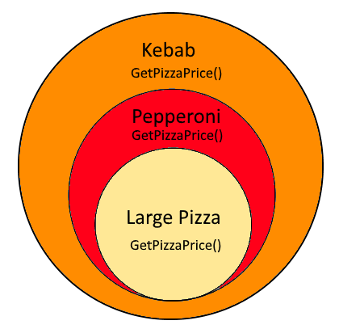
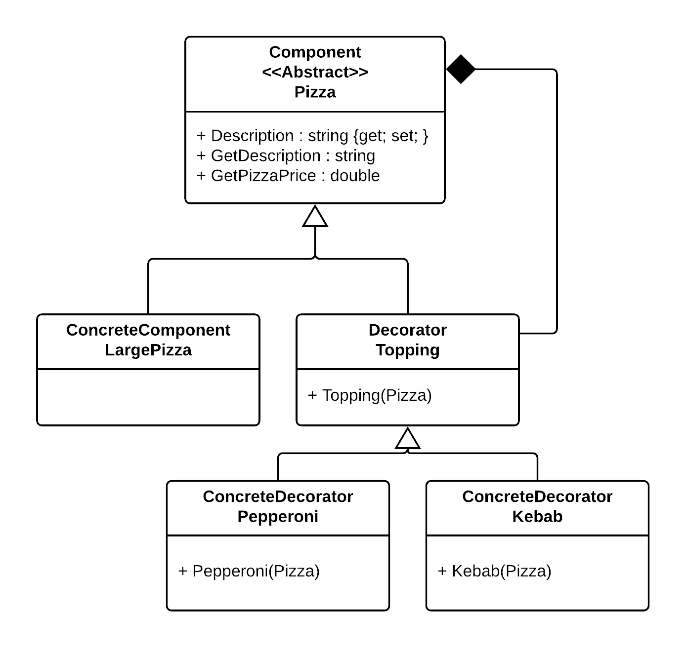

# Decorator Pattern
Is a structual pattern using composition to limit inheritance and simplify object relationships make them more manageable.
## Description

It is also sometimes referred to as the wrapping pattern, since it is wrapping new features on to the existing object.
In this example we are wrapping a large pizza with different toppings, where each topping will add to the base price and to the final description of the Pizza.
 
 

To easily remember what this pattern does, just think of Decorating a Pizza with diffrent toppings, where each topping would add a new description and price on to the exsting Pizza. 

Ex Large pizza = 100 + pepperoni = 10 = Large pizza with Pepperoni = 110.

